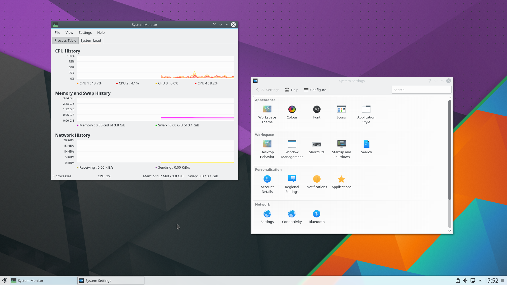
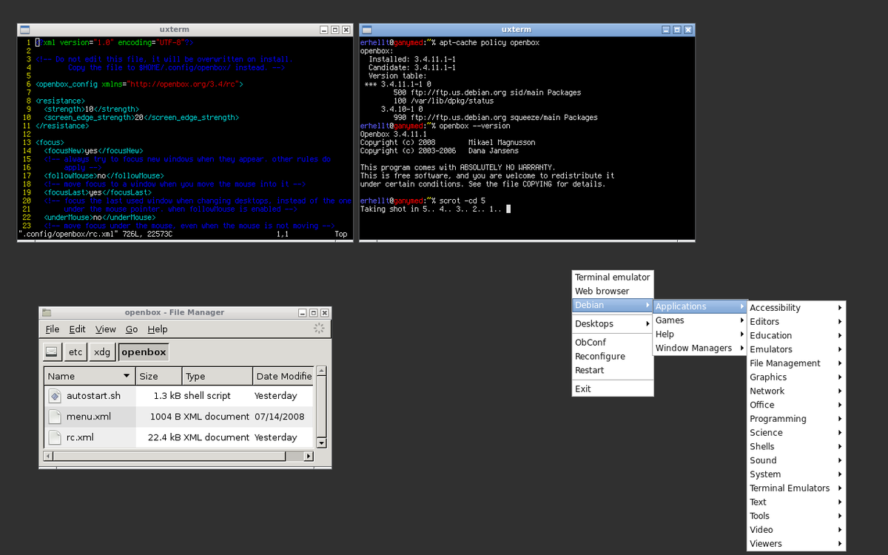
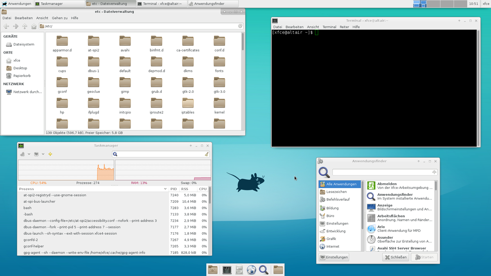

# Partes de un sistema operativo linux
## Kernel
El kernel es el nucleo del sistema operativo, es el encargado de comunicarse directamente con el hardware, y 
administrar el uso de procesador y memoria ram de las aplicaciones.
El kernel ocupa en RAM unos 150MB aproximadamente. 

## GUI - CLI

Para usar el sistema operativo, es necesario o una linea de comandos (CLI) o un entorno gráfico.
Un entorno gráfrico puede ser 
- Entorno de escritorio
- Gestor de ventanas
- Vetanas mosaico

### Entorno de escritorio
El entorno de escritorio proporciona además de una interfaz gráfica, un suite de aplicaciones coherentes entre 
si en diseño, funcionalidades y usabilidad.
Ejemplos:
- GNOME
- KDE 
- XFCE
- Mate
- Cinnamon

### Gestor de ventanas
A diferencia de los entornos de escritorio, un gestor de ventanas solo proporciona el layout y los controles de 
las ventanas de las aplicaciones.
Ejemplos:
- OpenBox
- FluxBox

### Ventanas mosaico

Este tipo de entornos graficos controlan el comportamiento de las ventanas en formatos de mosaico.
Ejemplos:
- i3
- Wmii

## ¿Que usar?

Dependiendo del uso que se le vaya a dar, la experiencia del usuario y del hardware en el que se vaya a usar será mas conveniente uno u otro.
Para uso doméstico, lo mas sencillo es usar un entorno de escritorio completo, ya que requiere poca configuración, practica, y será mas que suficiente para navegar por internet y ver películas, por ejemplo KDE o Cinnamon

Para un uso de productividad, lo mejor que se puede usar es un gestor de ventanas, ya que suelen consumir pocos recursos y no incluye programas extras que puedan distraer.

Para ordenadores con mucha potencia, KDE es la mejor opción, por su gestión de ventanas, facilidad de uso y diseño.
Para ordenadores menos potentes, Xfce, MATE o Cinnamon gastan menos recursos sin perder facilidad de uso.

Para ordenadores poco potentes, los gestores de ventanas son lo ideal, por los pocos recursos que requiere.
Si además de ordenador poco potente, el usuario es avanzado y quiere productividad, la opción ideal son las ventanas en mosaico

